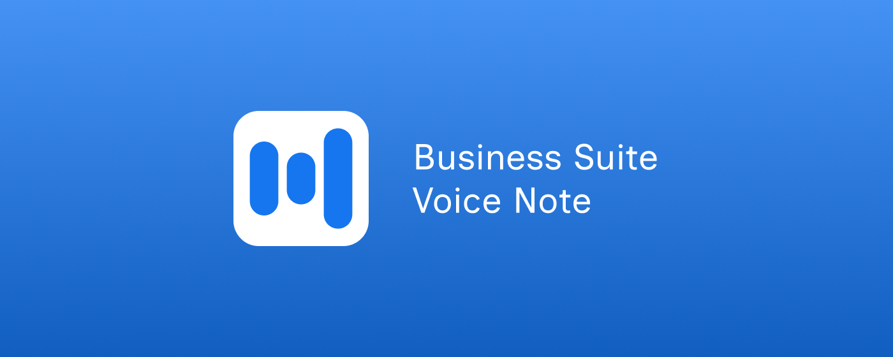

  

  <h1>🎙️ Business Suite Voice Note</h1>
  
  

    <strong>Bring seamless, native voice messaging to Meta Business Suite on desktop.</strong>
  

  
  
  
  

    

  
  
<em>Click, speak, and send — right from your inbox.</em>

---

## ⚡ Why Use This?

Meta currently lacks a native voice message sender in their web-based Business Suite. Managing customer inquiries through text can be slow and impersonal. This extension seamlessly bridges that gap by injecting a "Push-to-Talk" button directly into your chat toolbar. 

* ⏱️ **Save Time:** Talk instead of typing long customer support replies.
* 🎵 **Universal MP3:** Automatically compresses audio to `.mp3` so customers can listen on any device.
* 🌊 **Live Visualizer:** Real-time waveform confirms your mic is picking up audio.

---

## 🚀 How to Install

You can install the extension directly from the official store in seconds:

1. Go to the Business Suite Voice Note page on the **[Chrome Web Store](https://chromewebstore.google.com/detail/Business%20Suite%20Voice%20Note/fhackbmchhomdjfcjpenandgkhahedig)**.
2. Click **Add to Chrome**.
3. The extension will automatically install and activate. No manual setup required!

---

## 🎤 How to Use

1. **Navigate** to your [Meta Business Suite Inbox](https://business.facebook.com/latest/inbox).
2. **Locate the Mic:** Look at the chat toolbar at the bottom of the screen. You will see a new Microphone icon next to the "Attach a file" button.
3. **First Time Setup:** Click the mic. A quick educational modal will appear. When the browser prompts you at the top of the screen, select **"Allow on every visit"**.
4. **Record & Send:** Click the mic to start. Speak your message, watch the visualizer, and click **Done** to instantly convert and send the audio file.

---

## 🔒 Privacy & Security

Your privacy is paramount. This extension is built to run entirely locally.

* 🛑 **No Data Collection:** Audio is processed entirely in your browser's local memory (RAM) and injected directly into the Meta chat input. 
* ☁️ **No External Servers:** No audio, text, or user data is *ever* sent to the developer or any third-party servers.
* 🔑 **Strict Permissions:** We only request host access to `business.facebook.com` to ensure the script only runs inside your Meta inbox and nowhere else.

---

## 🤝 Acknowledgments & Open Source

This tool is made possible by incredible open-source software:

* **[lamejs](https://github.com/zhuker/lamejs):** A fast MP3 encoder written in JavaScript by zhuker. Licensed under the MIT License. Used to convert raw microphone audio into highly compressed, universally supported `.mp3` files entirely offline.

   
  Built for faster customer service.

